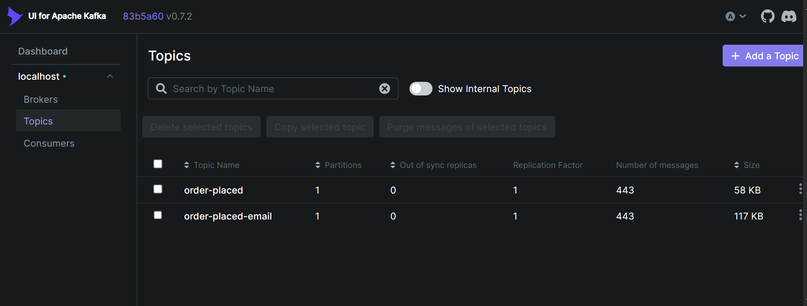
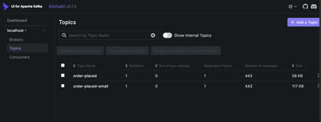
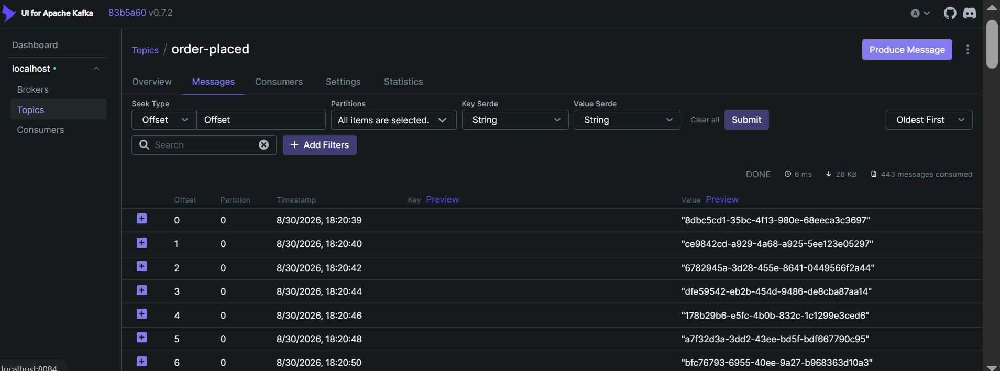
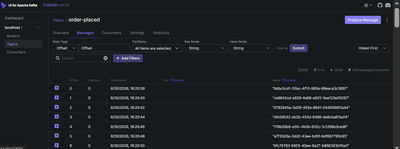
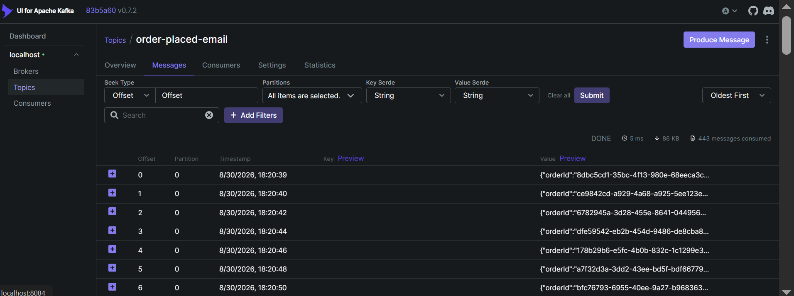
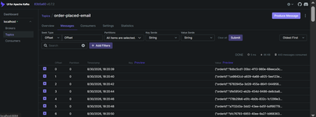
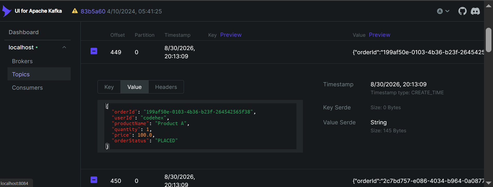
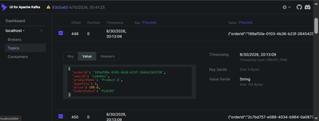

# Kafka-Springboot-Demo

A practical and comprehensive Spring Boot demonstration project showcasing **Apache Kafka** integration for asynchronous event-driven communication between microservices. This project implements a demo order processing system with event-based notifications.

## 📋 Table of Contents

- [Overview](#overview)
- [System Architecture](#system-architecture)
- [Services](#services)
- [Technologies Used](#technologies-used)
- [Prerequisites](#prerequisites)
- [Installation & Setup](#installation--setup)
- [Running the Services](#running-the-services)
- [Project Structure](#project-structure)
- [Configuration](#configuration)
- [How It Works](#how-it-works)
- [Data Flow](#data-flow)
- [API Endpoints](#api-endpoints)
- [Kafka Topics](#kafka-topics)
- [Future Enhancements](#future-enhancements)

## Overview

This project demonstrates a **microservices architecture** using Spring Boot and Apache Kafka for event-driven communication. The system simulates an e-commerce order processing workflow where:

- **Order Service** generates orders at regular intervals and publishes order events to Kafka topics
- **Notification Service** consumes order events and processes notifications

The project serves as an educational resource for understanding Kafka integration patterns in Spring Boot applications.

## System Architecture

```
┌──────────────────────────────────────────────────────────────┐
│                     Kafka Cluster                            │
│  ┌─────────────────────┐          ┌─────────────────────┐   │
│  │  order-placed       │          │ order-placed-email  │   │
│  │     Topic           │          │      Topic          │   │
│  └─────────────────────┘          └─────────────────────┘   │
└──────────────────────────────────────────────────────────────┘
           ▲                                    ▲
           │                                    │
      Produces                          Produces
           │                                    │
    ┌──────────────┐                   ┌──────────────┐
    │ Order Service│                   │  Notification│
    │   (Port 8080)│                   │   Service    │
    │              │                   │  (Port 8081) │
    │ - Generates  │                   │              │
    │   orders     │                   │ - Consumes   │
    │ - Publishes  │                   │   events     │
    │   events     │                   │ - Sends      │
    │              │◄──────────────────│   notifications
    └──────────────┘                   └──────────────┘
      Scheduled    │                   │  Consumes
        Task        └────────Consumes──┘
```

## Services

### 1. **Order Service** 
**Port:** `8080`

The Order Service is responsible for creating orders and publishing order events to Kafka.

**Key Features:**
- Automatically generates orders at fixed intervals (every 2 seconds)
- Creates unique order IDs using UUID
- Publishes order information to two Kafka topics:
  - `order-placed`: Contains the order ID
  - `order-placed-email`: Contains complete order notification details
- Built using Spring Boot with scheduled tasks (`@EnableScheduling`)

**Main Components:**
- `OrderServiceApplication.java`: Entry point with scheduling enabled
- `OrderService.java`: Contains business logic for order processing

**Sample Order Data:**
```
OrderNotification {
  orderId: "UUID",
  userId: "codehex",
  productName: "Product A",
  quantity: 1,
  price: 100.0,
  orderStatus: "PLACED"
}
```

### 2. **Notification Service**
**Port:** `8081`

The Notification Service consumes order events from Kafka topics and processes notifications.

**Key Features:**
- Listens to two Kafka topics for order events
- Deserializes JSON messages into OrderNotification objects
- Logs received notifications (ready for integration with notification systems)
- Handles errors gracefully during message deserialization

**Main Components:**
- `NotificationServiceApplication.java`: Entry point
- `NotificationService.java`: Contains message consumers

**Kafka Listeners:**
1. **Topic:** `order-placed` (Group: `notification-service`)
   - Receives simple order ID messages

2. **Topic:** `order-placed-email` (Group: `notification-service`)
   - Receives complete order notification details as JSON

## Technologies Used

| Component | Version | Purpose |
|-----------|---------|---------|
| Java | 21 | Programming Language |
| Spring Boot | 4.1.1 | Framework |
| Apache Kafka | Latest (embedded) | Message Broker |
| Lombok | Latest | Boilerplate code reduction |
| Jackson | 2.4.2+ | JSON serialization/deserialization |
| Maven | 3.6+ | Build tool |

## Prerequisites

Before running this project, ensure you have the following installed:

- **Java Development Kit (JDK) 21** or higher
  ```bash
  java -version
  ```

- **Maven 3.6.0** or higher
  ```bash
  mvn --version
  ```

- **Apache Kafka** (running instance)
  - Default configuration expects Kafka at `localhost:60092`
  - Can be started via Docker or standalone installation

- **Docker** (optional, for running Kafka)
  ```bash
  docker --version
  ```

## Installation & Setup

### Step 1: Clone or Navigate to the Project

```bash
cd <root path>\Kafka-Springboot-Demo
```

### Step 2: Start Kafka (recommended: Docker Compose)


This project contains a Docker Compose file under `order-service/docker-compose.yml`. Use that compose file to start the demo stack (it may include kafka-ui). Example:

```bash
docker compose -f order-service/docker-compose.yml up -d
```

Notes:
- The compose file referenced above should start Zookeeper, Kafka and (optionally) a Kafka UI. If kafka-ui is included it will typically be available at http://localhost:8080.
- The Kafka broker must be reachable at `localhost:60092` to match the services' `application.properties` configuration.

If you prefer a standalone Kafka installation you can still use the steps below (optional). For local development and demos, Docker Compose + kafka-ui is faster and easier to use.

#### Optional: Standalone Kafka Installation

1. Download Kafka from https://kafka.apache.org/downloads
2. Extract and navigate to the Kafka directory
3. Start Zookeeper:
   ```bash
   bin/zookeeper-server-start.sh config/zookeeper.properties
   ```
4. Start Kafka:
   ```bash
   bin/kafka-server-start.sh config/server.properties
   ```

### Step 3: Create Kafka Topics

Create the required topics before running the services:

```bash
# Using Docker
docker exec -it kafka-broker bash

# Create topics
kafka-topics --create --topic order-placed --bootstrap-server localhost:60092 --partitions 1 --replication-factor 1
kafka-topics --create --topic order-placed-email --bootstrap-server localhost:60092 --partitions 1 --replication-factor 1
```

Or standalone:
```bash
bin/kafka-topics.sh --create --topic order-placed --bootstrap-server localhost:60092
bin/kafka-topics.sh --create --topic order-placed-email --bootstrap-server localhost:60092
```

## Running the Services

### Option 1: Maven from Command Line

#### Terminal 1: Run Order Service
```bash
cd order-service
mvn clean spring-boot:run
```

#### Terminal 2: Run Notification Service
```bash
cd notification-service
mvn clean spring-boot:run
```

### Option 2: IDE (IntelliJ IDEA, Eclipse, etc.)

1. Open the project in your IDE
2. Run `OrderServiceApplication.java` as a Java application
3. Run `NotificationServiceApplication.java` as a Java application

### Option 3: Build and Run JAR Files

```bash
# Build Order Service
cd order-service
mvn clean install
java -jar target/order-service-0.0.1-SNAPSHOT.jar

# Build Notification Service
cd notification-service
mvn clean install
java -jar target/notification-service-0.0.1-SNAPSHOT.jar
```

## Project Structure

```
Kafka-Springboot-Demo/
├── order-service/
│   ├── src/
│   │   ├── main/
│   │   │   ├── java/com/codehex/
│   │   │   │   ├── event/
│   │   │   │   │   └── OrderNotification.java
│   │   │   │   └── orderservice/
│   │   │   │       ├── OrderServiceApplication.java
│   │   │   │       └── service/
│   │   │   │           └── OrderService.java
│   │   │   └── resources/
│   │   │       └── application.properties
│   │   └── test/
│   │       └── java/
│   └── pom.xml
│
├── notification-service/
│   ├── src/
│   │   ├── main/
│   │   │   ├── java/com/codehex/
│   │   │   │   ├── event/
│   │   │   │   │   └── OrderNotification.java
│   │   │   │   └── notificationservice/
│   │   │   │       ├── NotificationServiceApplication.java
│   │   │   │       └── service/
│   │   │   │           └── NotificationService.java
│   │   │   └── resources/
│   │   │       └── application.properties
│   │   └── test/
│   │       └── java/
│   └── pom.xml
│
├── docs/
└── README.md


## Configuration

### Order Service (`order-service/src/main/resources/application.properties`)

```properties
spring.application.name=order-service

# Kafka Configuration
spring.kafka.bootstrap-servers=localhost:60092
spring.kafka.template.default-topic=order-placed
spring.kafka.producer.key-serializer=org.apache.kafka.common.serialization.StringSerializer
spring.kafka.producer.value-serializer=org.springframework.kafka.support.serializer.JsonSerializer
```

**Configuration Details:**
- **bootstrap-servers**: Kafka broker address and port
- **default-topic**: Default topic for messages
- **Serializers**: StringSerializer for keys, JsonSerializer for values (OrderNotification objects)

### Notification Service (`notification-service/src/main/resources/application.properties`)

```properties
spring.application.name=notification-service
server.port=8081

# Kafka Configuration
spring.kafka.bootstrap-servers=localhost:60092
spring.kafka.consumer.group-id=notification-service
spring.kafka.consumer.key-deserializer=org.apache.kafka.common.serialization.StringDeserializer
spring.kafka.consumer.value-deserializer=org.apache.kafka.common.serialization.StringDeserializer
spring.kafka.consumer.properties.spring.json.trusted.packages=com.codehex.event
spring.kafka.consumer.properties.spring.json.type.mapping=orderNotification:com.codehex.event.OrderNotification
```

**Configuration Details:**
- **group-id**: Consumer group for organizing consumers
- **Deserializers**: StringDeserializer for both keys and values
- **trusted.packages**: Security setting for JSON deserialization
- **type.mapping**: Maps JSON type hints to Java classes

## How It Works

### Order Processing Flow

1. **Order Generation** (Order Service)
   - `@Scheduled(fixedRate = 2000)` generates a new order every 2 seconds
   - Creates a unique UUID for each order
   - Logs the order ID

2. **Event Publishing** (Order Service)
   - Sends order ID to `order-placed` topic
   - Builds OrderNotification object with complete order details
   - Sends OrderNotification (as JSON) to `order-placed-email` topic
   - Logs confirmation of messages sent

3. **Event Consumption** (Notification Service)
   - `@KafkaListener` automatically subscribes to topics
   - Receives and deserializes messages
   - For `order-placed`: Receives simple order ID
   - For `order-placed-email`: Deserializes JSON into OrderNotification object
   - Logs received notifications (ready for further processing)
   - Handles deserialization errors gracefully

### Error Handling

Both services implement try-catch blocks to handle:
- Serialization/Deserialization errors
- Kafka connection issues
- Message processing exceptions

Errors are logged but don't stop the services from continuing operations.

## Data Flow

```
Time: 0s
┌─────────────────────────────────────────────────────────────┐
│ Order Service generates Order #1                            │
└─────────────────────────────────────────────────────────────┘
            │
            ├─► Kafka Topic: order-placed
            │       Message: "uuid-1234"
            │
            └─► Kafka Topic: order-placed-email
                    Message: {
                      "orderId": "uuid-1234",
                      "userId": "codehex",
                      "productName": "Product A",
                      "quantity": 1,
                      "price": 100.0,
                      "orderStatus": "PLACED"
                    }

Time: 0s+ (milliseconds)
┌─────────────────────────────────────────────────────────────┐
│ Notification Service receives messages                       │
└─────────────────────────────────────────────────────────────┘
            │
            ├─► Listener 1: Receives "uuid-1234" from order-placed
            │       Action: Logs order ID
            │
            └─► Listener 2: Receives JSON from order-placed-email
                    Action: Deserializes and logs full notification

Time: 2s
┌─────────────────────────────────────────────────────────────┐
│ Order Service generates Order #2 (repeat cycle)             │
└─────────────────────────────────────────────────────────────┘
```

## API Endpoints

### Order Service
- No REST endpoints exposed (all operations are scheduled)
- Production version would include:
  - `POST /api/orders` - Create order via API
  - `GET /api/orders/{orderId}` - Retrieve order details

### Notification Service
- No REST endpoints exposed (consumer only)
- Production version would include:
  - `GET /api/notifications/{userId}` - Retrieve user notifications
  - `GET /api/notifications` - Get all notifications

## Kafka Topics

| Topic | Producer | Consumer | Message Type | Purpose |
|-------|----------|----------|--------------|---------|
| `order-placed` | Order Service | Notification Service | String (Order ID) | Notify of new order |
| `order-placed-email` | Order Service | Notification Service | JSON (OrderNotification) | Send detailed order notification |

### Topic Screenshots (Kafka UI)

Below are screenshots showing the topics and messages as they appear in the Kafka UI dashboard (available at http://localhost:8080):

#### All Topics Overview

[](docs/1.Kafka-topics.png)

#### Order-Placed Topic

[](docs/2.Kafka-topics-order-placed.png)

#### Order-Placed-Email Topic

[](docs/3.Kafka-topics-order-placed-email.png)

#### Message Details

[](docs/4.Kafka-topics-order-placed-email-details.png)

### Topic Creation

Verify topics exist:
```bash
# Using Docker
docker exec -it kafka-broker kafka-topics --list --bootstrap-server localhost:60092

# Standalone
bin/kafka-topics.sh --list --bootstrap-server localhost:60092
```

Preferred (recommended): use the kafka-ui to inspect topics, partitions and message contents. When kafka-ui is present it is typically available at:

- http://localhost:8080 (after starting the compose stack with `docker compose -f order-service/docker-compose.yml up -d`)

The Kafka UI makes it easy to create topics, browse messages, and view consumer group offsets. The CLI commands above remain available as alternatives.

Monitor messages in real-time:
```bash
# Using Docker
docker exec -it kafka-broker kafka-console-consumer --topic order-placed --from-beginning --bootstrap-server localhost:60092

# Standalone
bin/kafka-console-consumer.sh --topic order-placed --from-beginning --bootstrap-server localhost:60092
```

## Monitoring and Logging

Both services log all activities:

**Order Service Logs:**
```
INFO: Processing order with ID: uuid-1234
INFO: Message sent to Kafka topic: order-placed with orderId: uuid-1234
INFO: Sending Order notification for order with ID: uuid-1234
INFO: Message sent to Kafka topic: order-placed-email with orderId: uuid-1234
```

**Notification Service Logs:**
```
INFO: Received order id: uuid-1234
INFO: Received order id: uuid-1234 (from order-placed-email)
INFO: Notification Sent: OrderNotification(orderId=uuid-1234, ...)
```

### Tail Logs in Real-Time (Terminal)

```bash
# For Order Service
tail -f order-service/target/order-service.log

# For Notification Service
tail -f notification-service/target/notification-service.log
```

Tip: For inspecting Kafka messages and topic contents in a user-friendly UI, open the Kafka UI at http://localhost:8080. It provides message browsing, topic creation, schema viewing and consumer group monitoring which is more convenient than console clients for routine debugging.

## Future Enhancements

1. **Database Integration**
   - Add database persistence layer (JPA/Hibernate)
   - Store orders in order-service database
   - Store notifications in notification-service database

2. **REST APIs**
   - Implement REST endpoints for order creation
   - Add endpoints for retrieving order history
   - Implement notification retrieval APIs

3. **Email Notification**
   - Integrate with Email service (JavaMailSender)
   - Send actual emails instead of just logging

4. **Additional Services**
   - Payment Service
   - Inventory Service
   - Shipping Service

5. **Advanced Features**
   - Transaction management
   - Retry mechanisms with exponential backoff
   - Dead-letter queues (DLQ) for failed messages
   - Analytics and monitoring (Prometheus, Grafana)
   - Tracing (ELK stack, Jaeger)
   - Security (Spring Security, OAuth2)

6. **Testing**
   - Unit tests for services
   - Integration tests with embedded Kafka
   - End-to-end tests

7. **Containerization**
   - Create Dockerfile for both services
   - Multi-service Docker Compose setup
   - Kubernetes deployment manifests

## Troubleshooting

### Issue: Connection refused to Kafka

**Solution:** Ensure Kafka is running and accessible at `localhost:60092`
```bash
# Test connection
telnet localhost 60092
```

### Issue: Topic not found

**Solution:** Create the topics before running services
```bash
docker exec kafka-broker kafka-topics --create --topic order-placed --bootstrap-server localhost:60092
```

### Issue: Message deserialization error

**Solution:** Ensure JSON format matches OrderNotification class structure and trusted packages are configured

### Issue: Services not communicating

**Solution:** 
1. Verify Kafka is running
2. Check Kafka topic names match in both services
3. Review application.properties for correct bootstrap-servers
4. Check logs for specific error messages

## Contributing

To contribute to this project:

1. Create a new branch for your feature
2. Make your changes and test thoroughly
3. Follow the existing code style and patterns
4. Submit a pull request with a clear description

## License

This project is for educational purposes.

## Contact & Support

For questions or issues:
- Review the logs in both services for detailed error messages
- Check Kafka broker connectivity
- Verify all configuration properties are correctly set

---

**Happy learning! 🚀**

